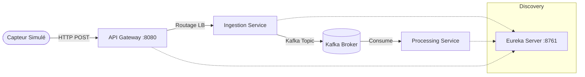

# Rapport Complet : Architectures N-Tiers & Microservices IoT

**Université Hassan Premier - FST Settat**
**Module :** Architectures N-Tiers
**Réalisé par :** [Votre Nom]
**Dépôt GitHub :** [https://github.com/Afakhar27/Ntiers-kafka-microservices-iot.git](https://github.com/Afakhar27/Ntiers-kafka-microservices-iot.git)

---

## 1. Introduction Générale

Ce projet vise à mettre en œuvre une architecture distribuée moderne et résiliente. Il se divise en deux parties complémentaires :
1.  **Architecture de Messagerie (Partie 1)** : Implémentation de patterns de communication asynchrone robustes avec Apache Kafka (mode KRaft), gestion de la sérialisation JSON et du polymorphisme d'événements.
2.  **Architecture Microservices IoT (Partie 2)** : Conception d'un système complet de capteurs connectés utilisant l'écosystème Spring Cloud (Eureka, Gateway) pour l'ingestion, le traitement et la visualisation de données temps réel.

---

## 2. Technologies Utilisées

### Backend & Infrastructure
*   **Langage :** Java 17
*   **Framework :** Spring Boot 3.x (Web, Kafka)
*   **Cloud :** Spring Cloud (Netflix Eureka, Gateway)
*   **Messaging :** Apache Kafka 3.9.0 (Mode KRaft sans ZooKeeper)
*   **Conteneurisation :** Docker & Docker Compose

### Frontend
*   **Framework :** React.js
*   **Visualisation :** Recharts (Graphiques temps réel)
*   **Styling :** Material UI

---

## 3. Partie 1 : Messagerie Avancée avec Kafka

Cette partie se concentre sur la communication asynchrone entre producteurs et consommateurs.

### 3.1 Installation Kafka (Mode KRaft)
Nous avons utilisé le mode **KRaft (Kafka Raft Metadata)** qui supprime la dépendance à ZooKeeper.
*   **UUID du cluster :** Généré via `kafka-storage random-uuid`.
*   **Rôle Node :** Le nœud agit en tant que `broker,controller` combiné.

### 3.2 Fonctionnalités Développées
1.  **Messages Simples :** Échange de chaînes de caractères (`StringSerializer`).
2.  **Objets JSON :** Sérialisation automatique de DTOs (`NotificationEvent`).
3.  **Polymorphisme :** Gestion d'événements multiples (`UserRegisteredEvent`, `OrderCreatedEvent`) sur un topic unique.

### 3.3 Explication du Code (Backend)
**Gestion du Polymorphisme :**
Pour permettre à un consommateur de distinguer les types d'événements reçus sur un même topic, nous avons utilisé une configuration hybride Jackson/Spring Kafka.

*   **DTO Parent (`BaseEvent`) :**
    Utilisation des annotations Jackson pour inclure une propriété discriminante "type" dans le JSON.
    ```java
    @JsonTypeInfo(use = JsonTypeInfo.Id.NAME, property = "type")
    @JsonSubTypes({
        @JsonSubTypes.Type(value = UserRegisteredEvent.class, name = "user"),
        @JsonSubTypes.Type(value = OrderCreatedEvent.class, name = "order")
    })
    public abstract class BaseEvent { ... }
    ```

*   **Configuration Kafka (`KafkaConfig`) :**
    Nous utilisons `JsonSerializer.TYPE_MAPPINGS` pour mapper les classes Java à des alias dans les en-têtes Kafka (`__TypeId__`).
    ```java
    props.put(JsonSerializer.TYPE_MAPPINGS, 
        "user:com.example.kafkaapp.dto.polymorphic.UserRegisteredEvent," +
        "order:com.example.kafkaapp.dto.polymorphic.OrderCreatedEvent");
    props.put(JsonDeserializer.TRUSTED_PACKAGES, "com.example.kafkaapp.dto.*");
    ```

*   **Consommateur (`PolymorphicConsumer`) :**
    Le listener reçoit le type abstrait `BaseEvent` et traite l'objet selon son instance réelle.
    ```java
    @KafkaListener(topics = "polymorphic-events", ...)
    public void listen(BaseEvent event) {
        if (event instanceof UserRegisteredEvent) { ... }
        else if (event instanceof OrderCreatedEvent) { ... }
    }
    ```

---

## 4. Partie 2 : Microservices IoT

Architecture réactive capable de gérer un flux de données capteurs.

### 4.1 Architecture Globale


### 4.2 Composants Backend (Microservices)

1.  **Eureka Server (`eureka-server`) :**
    *   Annuaire de services permettant aux microservices de se découvrir dynamiquement sans IP fixes.
    *   Annotation : `@EnableEurekaServer`.

2.  **API Gateway (`api-gateway`) :**
    *   Point d'entrée unique. Redirige les requêtes HTTP externes vers les services internes.
    *   **Routage Dynamique :** Utilise `DiscoveryClient` pour router `/api/ingestion/**` vers `lb://ingestion-service`.

3.  **Sensor Simulator (`sensor-simulator`) :**
    *   Service autonome générant des données aléatoires toutes les 5 secondes via `@Scheduled`.
    *   Envoie des requêtes POST à la Gateway.

4.  **Ingestion Service (`ingestion-service`) :**
    *   Expose une API REST `/data`.
    *   Valide les données et agit comme **Producteur Kafka** vers le topic `temperature-readings`.

5.  **Processing Service (`processing-service`) :**
    *   **Consommateur Kafka**.
    *   Logique métier : Si `température > 24°C`, déclenche une **ALERTE CRITIQUE**.
    *   Ceci assure le découplage : le traitement peut être lent sans ralentir l'ingestion.

### 4.3 Frontend (React)
L'interface utilisateur permet de visualiser les données en temps réel.
*   **Composants :**
    *   `IoTDashboard.jsx` : Récupère l'historique des températures via l'API.
    *   `ServiceStatus.jsx` : Affiche l'état des services.
*   **Flux :** Appelle `http://localhost:8080/api/ingestion/data` (via proxy Gateway) pour afficher la courbe de température et la liste des alertes.

---

## 5. Justifications & Réponses Théoriques

### 5.1 Justifications des Choix Techniques
Le projet respecte scrupuleusement les patrons d'architecture moderne :

*   **Messagerie Asynchrone (Kafka) :**
    L'utilisation de Kafka assure un **découplage temporel et spatial** entre le producteur (`ingestion-service`) et le consommateur (`processing-service`).
    *   *Justification :* Pour l'IoT, où les capteurs envoient des données en continu, bloquer le fil d'exécution pour le traitement (HTTP synchrone) serait catastrophique. Kafka agit comme un tampon (buffer) résilient capable d'absorber des pics de charge sans perte de données.

*   **Service Discovery (Eureka) :**
    Le registre de services permet une architecture dynamique.
    *   *Justification :* Dans Docker, les IPs sont volatiles. Eureka permet de router les requêtes via des noms logiques (`lb://ingestion-service`), rendant l'infrastructure élastique (ajout/suppression d'instances sans reconfiguration).

*   **API Gateway (Spring Cloud Gateway) :**
    Point d'entrée unique du système.
    *   *Justification :* Elle masque la complexité interne au client (Frontend React). Au lieu d'appeler N services sur N ports, le frontend appelle uniquement la gateway, qui gère le load balancing et la sécurité centralisée.

### 5.2 Réponses aux Questions Théoriques

**Q1 : En quoi l'architecture événementielle favorise-t-elle la scalabilité ?**
*Réponse :* Elle permet d'ajouter des instances de consommateurs (Consumer Groups) pour paralléliser le traitement d'un même topic sans modifier le producteur. Si la charge augmente, on ajoute simplement des instances de `processing-service`.

**Q2 : Quelle est la différence fondamentale entre un Topic Kafka et une File JMS classique ?**
*Réponse :* Dans JMS/RabbitMQ, le message est généralement supprimé une fois consommé. Dans Kafka, le message est stocké durablement dans un journal de logs (Commit Log). Les consommateurs ne font que déplacer un curseur (offset). Cela permet de relire les messages passés ou d'avoir plusieurs consommateurs différents lisant les mêmes données à leur propre rythme.

**Q3 : Pourquoi le mode KRaft est-il l'avenir de Kafka ?**
*Réponse :* Il supprime la dépendance lourde à ZooKeeper pour la gestion des métadonnées. Le contrôleur Kafka gère lui-même le quorum via le protocole Raft, simplifiant le déploiement et la maintenance (une seule binaire à gérer).

---

## 6. Guide d'Exécution

### Prérequis
*   Docker Desktop installé et démarré.

### Lancement Automatique (Recommandé)
Nous avons créé une configuration Docker Compose unifiée pour lancer les deux parties (Kafka App + Microservices).

1.  Ouvrir un terminal à la racine du projet.
2.  Exécuter la commande :
    ```bash
    docker-compose -f docker-compose-full.yml up --build -d
    ```

### Vérification du fonctionnement
*   **Frontend :** Accéder à [http://localhost:3000](http://localhost:3000). Vous verrez le graphique des températures se mettre à jour toutes les 5 secondes.
*   **Eureka Dashboard :** [http://localhost:8761](http://localhost:8761). Vérifiez que `API-GATEWAY`, `INGESTION-SERVICE`, et `PROCESSING-SERVICE` sont enregistrés.
*   **Tests Manuels (Partie 1) :**
    ```bash
    # Test Polymorphisme
    curl -X POST -H "Content-Type: application/json" -d '{"type":"user","username":"TestUser","eventId":"uuid","timestamp":"2026-02-07T12:00:00Z"}' http://localhost:8085/api/events/user-registered
    ```

### Logs et Alertes
Pour vérifier le traitement critique (Partie 2) :
```bash
docker logs -f processing-service
```
Dès que le simulateur génère une température > 24°C, le log affiche :
`ALERTE CRITIQUE : Température élevée détectée sur le capteur TEMP-001 : 24.x°C`

---

## 7. Conclusion
Ce projet a permis de maîtriser les fondamentaux des architectures distribuées :
1.  **Découplage** fort grâce à Kafka : le producteur ne connait pas le consommateur.
2.  **Scalabilité** grâce à Eureka et Spring Cloud Gateway.
3.  **Robustesse** : Le système continue d'ingérer des données même si le service de traitement (Processing) est temporairement indisponible.

Le code source complet est disponible sur GitHub : [Lien du dépôt](https://github.com/Afakhar27/Ntiers-kafka-microservices-iot.git).
