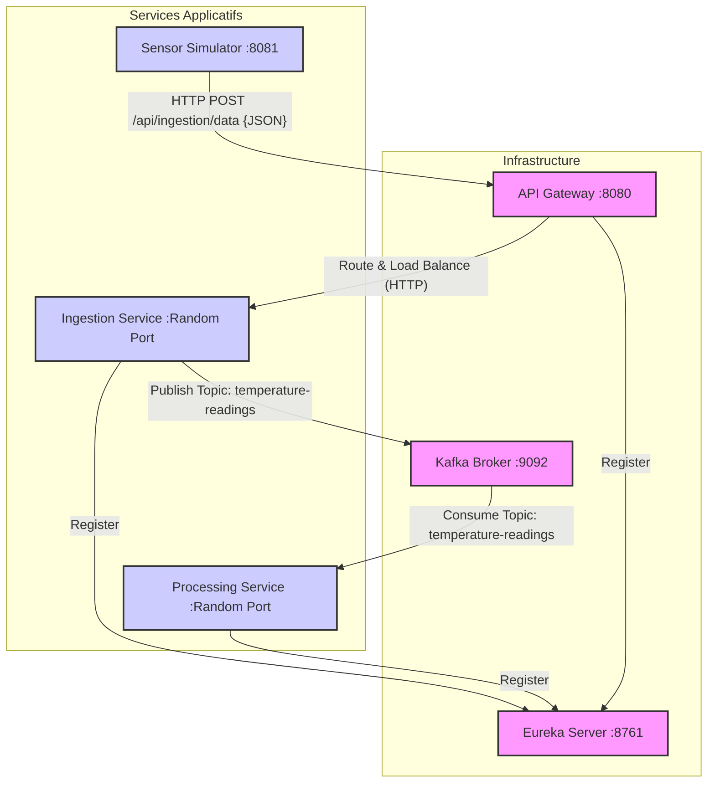

# Rapport Partie 2 : Architecture Microservices IoT avec Spring Cloud

## Objectif 3 : Analyse et Validation de l'Architecture

### 1. Diagramme d'Architecture

### 2. Démarrage et Observation

**Ordre de démarrage recommandé :**
1.  **Kafka Cluster** : Nécessaire pour que les services puissent s'y connecter au démarrage.
2.  **Eureka Server** : Le registre doit être prêt avant que les clients ne tentent de s'enregistrer.
3.  **Ingestion Service** & **Processing Service** : Peuvent démarrer en parallèle. Ils vont s'enregistrer auprès d'Eureka.
4.  **API Gateway** : Doit démarrer après Eureka pour récupérer la liste des services disponibles.
5.  **Sensor Simulator** : Démarre en dernier pour commencer à envoyer du trafic une fois que tout le pipeline est prêt.

**Séquence observée (Logs) :**
1.  **Simulateur** : Log `Donnée envoyée: 21.5` toutes les 5 secondes.
2.  **Gateway** : Reçoit la requête sur `/api/ingestion/data`, consulte Eureka, identifie une instance de `ingestion-service`, et redirige la requête vers `/data` sur l'instance cible.
3.  **Ingestion Service** :
    *   Reçoit le POST sur `/data`.
    *   Valide la donnée.
    *   Log `Published to Kafka: SensorData{...}`.
4.  **Kafka** : Reçoit le message et le stocke dans le topic `temperature-readings`.
5.  **Processing Service** :
    *   Le `@KafkaListener` se réveille.
    *   Log `Processing received: SensorData{...}`.
    *   Si T > 24.0, Log `ALERTE CRITIQUE : ...`.

**Preuve de fonctionnement :**
Le fait que le simulateur (qui ne connait que la Gateway port 8080) réussisse à faire parvenir des données au service d'ingestion (qui tourne sur un port aléatoire connu seulement d'Eureka) prouve que le routage dynamique fonctionne. Le fait que le service de traitement réagisse sans appel direct du service d'ingestion prouve que la messagerie asynchrone fonctionne.

### 3. Justification de Kafka vs REST Synchrone

L'utilisation de Kafka comme middleware de messagerie offre plusieurs avantages cruciaux pour un système IoT par rapport à une communication HTTP directe (synchrone) :

1.  **Découplage Temporel :** Si `Processing Service` tombe en panne ou redémarre, `Ingestion Service` peut continuer à recevoir des données et les empiler dans Kafka. Une fois redémarré, le service de traitement rattrapera son retard (consommation des offsets). En HTTP synchrone, les données seraient perdues ou l'appel échouerait, bloquant l'ingestion.
2.  **Lissage de charge (Throttling) :** En cas de pic soudain de données IoT (ex: millions de capteurs), le service d'ingestion peut écrire très vite dans Kafka. Le service de traitement peut consommer à son propre rythme sans être submergé. En HTTP, une surcharge du traitement ferait tomber l'ingestion en cascade (backpressure difficile à gérer).
3.  **Scalabilité :** On peut avoir plusieurs instances de `Processing Service` dans le même "Consumer Group". Kafka répartira automatiquement la charge des partitions entre les instances. Ajouter un consommateur est transparent pour le producteur.
4.  **Extensibilité :** Si demain nous voulons ajouter un service d'archivage (Data Lake), il suffit d'ajouter un nouveau Consumer Group sur le même topic. Le service d'ingestion n'a pas besoin d'être modifié. En HTTP, il faudrait modifier le code de l'appelant pour contacter le nouveau service.
